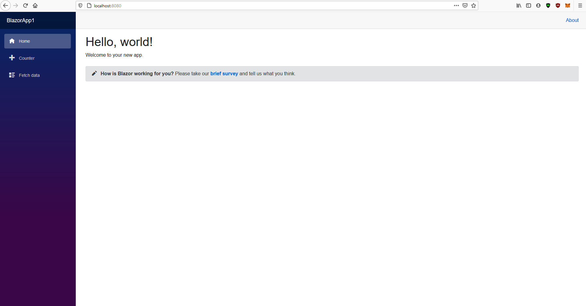

[![Build Status][build-shield]][build-url]
[![Contributors][contributors-shield]][contributors-url]
[![MIT License][license-shield]][license-url]

<!-- PROJECT LOGO -->
<br />
<div align="center">
    <a href="https://github.com/helloitsm3/blazor-wasm-template">
        
    </a>
    <h3>Blazor WASM Template with Docker and Nginx</h3>
</div>

<div align="center">
    <p>A template to easily host Blazor application using Docker and Nginx.</p>
    <a href="https://github.com/helloitsm3/blazor-wasm-template/issues">Report Bug</a>
    ·
    <a href="https://github.com/helloitsm3/blazor-wasm-template/issues">
        Request Feature
    </a>
</div>

<!-- TABLE OF CONTENTS -->

## Table of Contents

- [About the Project](#about-the-project)
  - [Built With](#built-with)
- [Getting Started](#getting-started)
  - [Prerequisites](#prerequisites)
- [Usage](#usage)
- [Contributing](#contributing)
- [License](#license)
- [Acknowledgements](#acknowledgements)

<!-- ABOUT THE PROJECT -->

## About The Project



This template aims at helping developers to understand and containerise their Blazor WASM app using Docker. Based on the article [here](https://dev.to/helloitsm3/how-to-setup-blazor-app-with-nginx-and-docker-11le)

### Built With

This section contains all the resources that was used.

<a href="https://dotnet.microsoft.com/apps/aspnet/web-apps/blazor" target="_blank">
    
</a>

<a href="https://visualstudio.microsoft.com/vs/" target="_blank">
    
</a>

<a href="https://www.docker.com/" target="_blank">
    
</a>

<a href="https://www.nginx.com/" target="_blank">
    
</a>

<!-- GETTING STARTED -->

## Getting Started

To get a local copy up and running follow these simple example steps.

- Docker

```docker
docker build -t blazor-wasm .
docker run -p 8080:80 --name webapp blazor-wasm
```

- Browser

```sh
Go to http://localhost:8080 on your browser
```

## Contributing

Contributions are what make the open source community such an amazing place to be learn, inspire, and create. Any contributions you make are **greatly appreciated**.

1. Fork the Project
2. Create your Feature Branch (`git checkout -b feature/blazor-wasm-feature`)
3. Commit your Changes (`git commit -m 'Add some blazor-wasm-feature'`)
4. Push to the Branch (`git push origin feature/blazor-wasm-feature`)
5. Open a Pull Request

<!-- LICENSE -->

## License

Distributed under the MIT License. See `LICENSE` for more information.

<!-- ACKNOWLEDGEMENTS -->

## Acknowledgements

- [Chris Sainty Article](https://chrissainty.com/containerising-blazor-applications-with-docker-containerising-a-blazor-webassembly-app/)
- [Img Shields](https://shields.io)
- [Choose an Open Source License](https://choosealicense.com)

[build-shield]: https://img.shields.io/badge/build-passing-brightgreen.svg?style=flat-square
[build-url]: #
[contributors-shield]: https://img.shields.io/badge/contributors-1-orange.svg?style=flat-square
[contributors-url]: https://github.com/helloitsm3/blazor-wasm-template/graphs/contributors
[license-shield]: https://img.shields.io/badge/license-MIT-blue.svg?style=flat-square
[license-url]: https://choosealicense.com/licenses/mit
